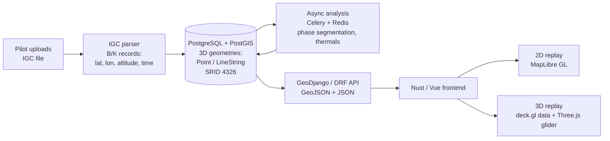
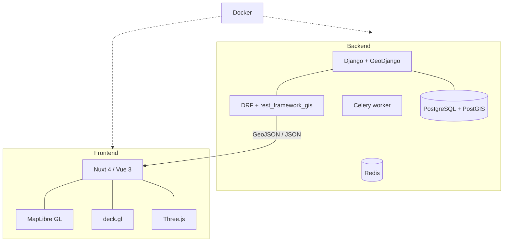

# RSFly — Architecture

RSFly turns an uploaded paragliding flight log (**IGC** file) into a queryable **3D geospatial
record**, analyses it asynchronously, and serves it to a web frontend that replays the flight in 2D
and 3D. This document describes the architecture at a level safe for public sharing — it does not
include production code, private parameters, or internal algorithms.

---

## Data flow

---

## Components

---

## Spatial data model

Tracks are stored as **true 3D geometries** in PostGIS (SRID 4326 / WGS 84), not as flat JSON arrays:

- **launch** and **landing** as 3D `Point` geometries;
- the **full track** as a 3D `LineString` (longitude, latitude, altitude);
- **timestamps** stored alongside the coordinates, so the replay is time-accurate.

**GiST** indexes back proximity and bounding-box queries, so geospatial work happens in the database.
Proximity queries use the **`geography`** type (geodetic `ST_DWithin`) so distances come out in
**metres**, not the degrees you would get from raw SRID 4326 geometry.

---

## Processing pipeline

1. **Upload & validate.** The IGC file is validated and parsed; malformed fixes are skipped rather
   than aborting the whole flight.
2. **Persist geometry.** The parsed fixes become a 3D `LineString` plus launch/landing points.
3. **Analyse asynchronously.** Heavier work — flight-phase segmentation and thermal detection — runs
   on a **Celery** worker backed by **Redis**, keeping the upload request responsive.

---

## API

The API is **GeoJSON-first**: spatial resources (tracks, points of interest) are returned as GeoJSON —
and therefore in WGS 84 / SRID 4326, as the GeoJSON spec requires — via Django REST Framework +
`rest_framework_gis`. Non-spatial metadata is plain JSON.

---

## Frontend & replay

The **Nuxt / Vue** app consumes the GeoJSON/JSON API and offers two replay modes:

- a **2D** map replay on **MapLibre GL**;
- a **3D** replay that composes **deck.gl** data layers (track, thermals) over the MapLibre base map,
  with **Three.js** rendering the 3D glider model.

The glider animates along the track using the stored per-fix timestamps, and the timeline is
scrubbable.

---

## Privacy posture

Flight tracks reveal where a pilot launches and flies, so privacy is treated as a design constraint
rather than an afterthought:

- **Raw IGC is never public.** IGC files and full-resolution tracks are served only to their owner,
  behind authentication — never from a public endpoint.
- **Launch/landing are coarsened.** On shared and public surfaces, start and end points are reduced in
  precision server-side before serialization, so an exact home site is not exposed.
- **Comparison is aggregate.** Leaderboard and "where do people fly" views use aggregated geometry,
  not another pilot's point-by-point track.

The specific parameters are intentionally not published; the mechanisms above are the design.

---

## Infrastructure

The system is containerised with **Docker**: web (Django), worker (Celery), database
(PostgreSQL/PostGIS), cache/broker (Redis), and the Nuxt frontend.
